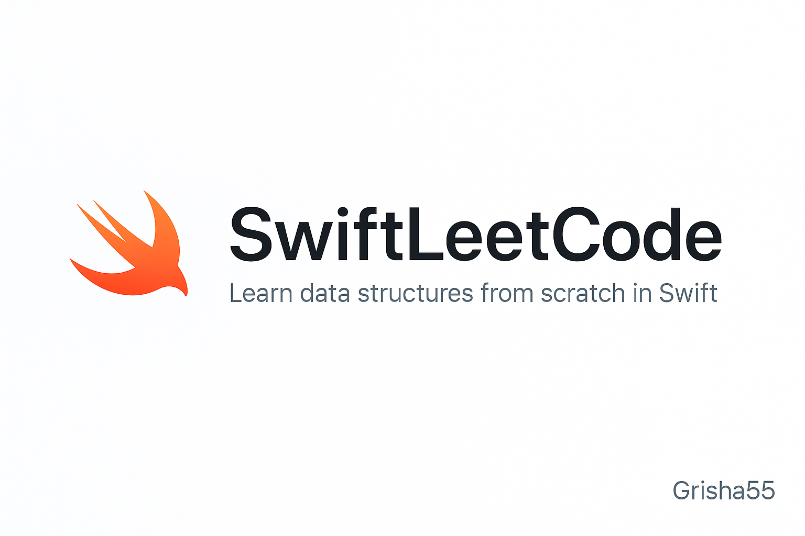

<p align="center">
  
</p>

# SwiftLeetCode


This repository contains my Swift solutions for various LeetCode problems.

# 🚀 Swift LeetCode Solutions

A personal collection of LeetCode problems solved in Swift.  
This repo is part of my journey to master data structures, algorithms, and technical interviews.

---

## 📁 Repository Structure

Each solution is placed in a folder named by its problem number and title:

```
├── 0001-Two-Sum/
│ └── Solution.swift
│ └── Problem.md
├── 0002-Add-Two-Numbers/
│ └── Solution.swift
│ └── Problem.md
├── 0003-Longest-Substring-Without-Repeating-Characters/
│ └── Solution.swift
│ └── Problem.md
├── 0004-Median-Of-Two-Sorted-Arrays/
│ └── Solution.swift
│ └── Problem.md
├── 0005-Longest-Palindromic-Substring/
│ └── Solution.swift
│ └── Problem.md
├── 0006-Zigzag-Conversion/
│ └── Solution.swift
│ └── Problem.md
├── 0007-Reverse-Integer/
│ └── Solution.swift
│ └── Problem.md
├── 0008-String-to-Integer/
│ └── Solution.swift
│ └── Problem.md
├── 0009-Palindrome-Number/
│ └── Solution.swift
│ └── Problem.md
├── 0010-Regular-Expression-Matching/
│ └── Solution.swift
│ └── Problem.md
├── 0011-Container-With-Most-Water/
│ └── Solution.swift
│ └── Problem.md
├── 0012-Integer-to-Roman/
│ └── Solution.swift
│ └── Problem.md
├── 0013-Roman-To-Integer/
│ └── Solution.swift
│ └── Problem.md
├── 0014-Longest-Common-Prefix/
│ └── Solution.swift
│ └── Problem.md
├── 0015-3Sum/
│ └── Solution.swift
│ └── Problem.md
├── 0016-3Sum-Closest/
│ └── Solution.swift
│ └── Problem.md
├── 0017-Letter-Combinations-of-a-Phone-Number/
│ └── Solution.swift
│ └── Problem.md
├── 0018-4Sum/
│ └── Solution.swift
│ └── Problem.md
├── 0019-Remove-Nth-Node-From-End-of-List/
│ └── Solution.swift
│ └── Problem.md
├── 0020-Valid-Parentheses/
│ └── Solution.swift
│ └── Problem.md
├── 0021-Merge-Two-Sorted-Lists/
│ └── Solution.swift
│ └── Problem.md
├── 0022-Generate-Parentheses/
│ └── Solution.swift
│ └── Problem.md
├── 0026-Remove-Duplicates-from-Sorted-Array/
│ └── Solution.swift
│ └── Problem.md
├── 0027-Remove-Element/
│ └── Solution.swift
│ └── Problem.md
├── 0028-Find-the-Index-of-the-First-Occurrence-in-a-String/
│ └── Solution.swift
│ └── Problem.md
├── 0032-Longest-Valid-Parentheses/
│ └── Solution.swift
│ └── Problem.md
├── 0034-Find-First-and-Last-Position-of-Element-in-Sorted-Array/
│ └── Solution.swift
│ └── Problem.md
├── 0035-Search-Insert-Position/
│ └── Solution.swift
│ └── Problem.md
├── 0036-Valid-Sudoku/
│ └── Solution.swift
│ └── Problem.md
├── 0037-Sudoku-Solver/
│ └── Solution.swift
│ └── Problem.md
├── 0042-Trapping-Rain-Water/
│ └── Solution.swift
│ └── Problem.md
├── 0049-Group-Anagrams/
│ └── Solution.swift
│ └── Problem.md
├── 0053-Maximum-Subarray/
│ └── Solution.swift
│ └── Problem.md
├── 0058-Length-of-Last-Word/
│ └── Solution.swift
│ └── Problem.md
├── 0059-Spiral-Matrix-II/
│ └── Solution.swift
│ └── Problem.md
├── 0062-Unique-Paths/
│ └── Solution.swift
│ └── Problem.md
├── 0063-Unique-Paths-II/
│ └── Solution.swift
│ └── Problem.md
├── 0064-Minimum-Path-Sum/
│ └── Solution.swift
│ └── Problem.md
├── 0066-Plus-One/
│ └── Solution.swift
│ └── Problem.md
├── 0067-Add-Binary/
│ └── Solution.swift
│ └── Problem.md
├── 0069-Sqrt-x/
│ └── Solution.swift
│ └── Problem.md
├── 0070-Climbing-Stairs/
│ └── Solution.swift
│ └── Problem.md
├── 0072-Edit-Distance/
│ └── Solution.swift
│ └── Problem.md
├── 0073-Set-Matrix-Zeroes/
│ └── Solution.swift
│ └── Problem.md
├── 0076-Minimum-Window-Substring/
│ └── Solution.swift
│ └── Problem.md
├── 0083-Remove-Duplicates-from-Sorted-List/
│ └── Solution.swift
│ └── Problem.md
├── 0088-Merge-Sorted-Array/
│ └── Solution.swift
│ └── Problem.md
├── 0091-Decode-Ways/
│ └── Solution.swift
│ └── Problem.md
├── 0094-Binary-Tree-Inorder-Traversal/
│ └── Solution.swift
│ └── Problem.md
├── 0095-Unique-Binary-Search-Trees-II/
│ └── Solution.swift
│ └── Problem.md
├── 0096-Unique-Binary-Search-Trees/
│ └── Solution.swift
│ └── Problem.md
├── 0100-Same-Tree/
│ └── Solution.swift
│ └── Problem.md
├── 0101-Symmetric-Tree/
│ └── Solution.swift
│ └── Problem.md
├── 0114-Flatten-Binary-Tree-to-Linked-List/
│ └── Solution.swift
│ └── Problem.md
├── 0115-Distinct-Subsequences/
│ └── Solution.swift
│ └── Problem.md
├── 0118-Pascals-Triangle/
│ └── Solution.swift
│ └── Problem.md
├── 0119-Pascals-Triangle-II/
│ └── Solution.swift
│ └── Problem.md
├── 0120-Triangle/
│ └── Solution.swift
│ └── Problem.md
├── 0121-Best-Time-to-Buy-and-Sell-Stock/
│ └── Solution.swift
│ └── Problem.md
├── 0122-Best-Time-to-Buy-and-Sell-Stock-II/
│ └── Solution.swift
│ └── Problem.md
├── 0123-Best-Time-to-Buy-and-Sell-Stock-III/
│ └── Solution.swift
│ └── Problem.md
├── 0124-Binary-Tree-Maximum-Path-Sum/
│ └── Solution.swift
│ └── Problem.md
├── 0125-Valid-Palindrome/
│ └── Solution.swift
│ └── Problem.md
├── 0128-Longest-Consecutive-Sequence/
│ └── Solution.swift
│ └── Problem.md
├── 0135-Candy/
│ └── Solution.swift
│ └── Problem.md
├── 0136-Single-Number/
│ └── Solution.swift
│ └── Problem.md
├── 0139-Word-Break/
│ └── Solution.swift
│ └── Problem.md
├── 0141-Linked-List-Cycle/
│ └── Solution.swift
│ └── Problem.md
├── 0155-Min-Stack/
│ └── Solution.swift
│ └── Problem.md
├── 0160-Intersection-of-Two-Linked-Lists/
│ └── Solution.swift
│ └── Problem.md
├── 0167-Two-Sum-II-Input-Array-Is-Sorted/
│ └── Solution.swift
│ └── Problem.md
├── 0168-Excel-Sheet-Column-Title/
│ └── Solution.swift
│ └── Problem.md
├── 0169-Majority-Element/
│ └── Solution.swift
│ └── Problem.md
├── 0171-Excel-Sheet-Column-Number/
│ └── Solution.swift
│ └── Problem.md
├── 0175-Combine-Two-Tables/
│ └── Solution.swift
│ └── Problem.md
├── 0188-Best-Time-to-Buy-and-Sell-Stock-IV/
│ └── Solution.swift
│ └── Problem.md
├── 0198-House-Robber/
│ └── Solution.swift
│ └── Problem.md
├── 0202-Happy-Number/
│ └── Solution.swift
│ └── Problem.md
├── 0204-Count-Primes/
│ └── Solution.swift
│ └── Problem.md
├── 0205-Isomorphic-Strings/
│ └── Solution.swift
│ └── Problem.md
├── 0213-House-Robber-II/
│ └── Solution.swift
│ └── Problem.md
├── 0217-Contains-Duplicate/
│ └── Solution.swift
│ └── Problem.md
├── 0221-Maximal-Square/
│ └── Solution.swift
│ └── Problem.md
├── 0229-Majority-Element-II/
│ └── Solution.swift
│ └── Problem.md
├── 0231-Power-of-Two/
│ └── Solution.swift
│ └── Problem.md
├── 0232-Implement-Queue-using-Stacks/
│ └── Solution.swift
│ └── Problem.md
├── 0234-Palindrome-Linked-List/
│ └── Solution.swift
│ └── Problem.md
├── 0238-Product-of-Array-Except-Self/
│ └── Solution.swift
│ └── Problem.md
├── 0242-Valid-Anagram/
│ └── Solution.swift
│ └── Problem.md
├── 0257-Binary-Tree-Paths/
│ └── Solution.swift
│ └── Problem.md
├── 0279-Perfect-Squares/
│ └── Solution.swift
│ └── Problem.md
├── 0283-Move-Zeroes/
│ └── Solution.swift
│ └── Problem.md
├── 0287-Find-the-Duplicate-Number/
│ └── Solution.swift
│ └── Problem.md
├── 0300-Longest-Increasing-Subsequence/
│ └── Solution.swift
│ └── Problem.md
├── 0309-Best-Time-to-Buy-and-Sell-Stock-with-Cooldown/
│ └── Solution.swift
│ └── Problem.md
├── 0322-Coin-Change/
│ └── Solution.swift
│ └── Problem.md
├── 0326-Power-of-Three/
│ └── Solution.swift
│ └── Problem.md
├── 0337-House-Robber-III/
│ └── Solution.swift
│ └── Problem.md
├── 0338-Counting-Bits/
│ └── Solution.swift
│ └── Problem.md
├── 0342-Power-of-Four/
│ └── Solution.swift
│ └── Problem.md
├── 0344-Reverse-String/
│ └── Solution.swift
│ └── Problem.md
├── 0345-Reverse-Vowels-of-a-String/
│ └── Solution.swift
│ └── Problem.md
├── 0347-Top-K-Frequent-Elements/
│ └── Solution.swift
│ └── Problem.md
├── 0349-Intersection-of-Two-Arrays/
│ └── Solution.swift
│ └── Problem.md
├── 0350-Intersection-of-Two-Arrays-II/
│ └── Solution.swift
│ └── Problem.md
├── 0354-Russian-Doll-Envelopes/
│ └── Solution.swift
│ └── Problem.md
├── 0367-Valid-Perfect-Square/
│ └── Solution.swift
│ └── Problem.md
├── 0374-Guess-Number-Higher-or-Lower/
│ └── Solution.swift
│ └── Problem.md
├── 0377-Combination-Sum-IV/
│ └── Solution.swift
│ └── Problem.md
├── 0383-Ransom-Note/
│ └── Solution.swift
│ └── Problem.md
├── 0386-Lexicographical-Numbers/
│ └── Solution.swift
│ └── Problem.md
├── 0387-First-Unique-Character-in-a-String/
│ └── Solution.swift
│ └── Problem.md
├── 0389-Find-the-Difference/
│ └── Solution.swift
│ └── Problem.md
├── 0392-Is-Subsequence/
│ └── Solution.swift
│ └── Problem.md
├── 0405-Convert-a-Number-to-a-Hexadecimal/
│ └── Solution.swift
│ └── Problem.md
├── 0409-Longest-Palindrome/
│ └── Solution.swift
│ └── Problem.md
├── 0412-Fizz-Buzz/
│ └── Solution.swift
│ └── Problem.md
├── 0415-Add-Strings/
│ └── Solution.swift
│ └── Problem.md
├── 0434-Number-of-Segments-in-a-String/
│ └── Solution.swift
│ └── Problem.md
├── 0438-Find-All-Anagrams-in-a-String/
│ └── Solution.swift
│ └── Problem.md
├── 0440-K-th-Smallest-in-Lexicographical-Order/
│ └── Solution.swift
│ └── Problem.md
├── 0442-Find-All-Duplicates-in-an-Array/
│ └── Solution.swift
│ └── Problem.md
├── 0448-Find-All-Numbers-Disappeared-in-an-Array/
│ └── Solution.swift
│ └── Problem.md
├── 0455-Assign Cookies/
│ └── Solution.swift
│ └── Problem.md
├── 0474-Ones-and-Zeroes/
│ └── Solution.swift
│ └── Problem.md
├── 0498-Diagonal-Traverse/
│ └── Solution.swift
│ └── Problem.md
├── 0509-Fibonacci-Number/
│ └── Solution.swift
│ └── Problem.md
├── 0516-Longest-Palindromic-Subsequence/
│ └── Solution.swift
│ └── Problem.md
├── 0518-Coin-Change-II/
│ └── Solution.swift
│ └── Problem.md
├── 0557-Reverse-Words-in-a-String-III/
│ └── Solution.swift
│ └── Problem.md
├── 0560-Subarray-Sum-Equals-K/
│ └── Solution.swift
│ └── Problem.md
├── 0567-Permutation-In-String/
│ └── Solution.swift
│ └── Problem.md
├── 0594-Longest-Harmonious-Subsequence/
│ └── Solution.swift
│ └── Problem.md
├── 0645-Set-Mismatch/
│ └── Solution.swift
│ └── Problem.md
├── 0646-Maximum-Length-of-Pair-Chain/
│ └── Solution.swift
│ └── Problem.md
├── 0653-Two-Sum-IV-Input-is-a-BST/
│ └── Solution.swift
│ └── Problem.md
├── 0661-Image-Smoother/
│ └── Solution.swift
│ └── Problem.md
├── 0673-Number-of-Longest-Increasing-Subsequence/
│ └── Solution.swift
│ └── Problem.md
├── 0679-24-Game/
│ └── Solution.swift
│ └── Problem.md
├── 0680-Valid-Palindrome-II/
│ └── Solution.swift
│ └── Problem.md
├── 0696-Count-Binary-Substrings/
│ └── Solution.swift
│ └── Problem.md
├── 0704-Binary-Search/
│ └── Solution.swift
│ └── Problem.md
├── 0712-Minimum-ASCII-Delete-Sum-for-Two-Strings/
│ └── Solution.swift
│ └── Problem.md
├── 0714-Best-Time-to-Buy-and-Sell-Stock-with-Transaction-Fee/
│ └── Solution.swift
│ └── Problem.md
├── 0740-Delete-and-Earn/
│ └── Solution.swift
│ └── Problem.md
├── 0746-Min-Cost-Climbing-Stairs/
│ └── Solution.swift
│ └── Problem.md
├── 0767-Reorganize-String/
│ └── Solution.swift
│ └── Problem.md
├── 0771-Jewels-and-Stones/
│ └── Solution.swift
│ └── Problem.md
├── 0790-Domino-and-Tromino-Tiling/
│ └── Solution.swift
│ └── Problem.md
├── 0808-Soup-Servings/
│ └── Solution.swift
│ └── Problem.md
├── 0837-New-21-Game/
│ └── Solution.swift
│ └── Problem.md
├── 0838-Push-Dominoes/
│ └── Solution.swift
│ └── Problem.md
├── 0852-Peak-Index-in-a-Mountain-Array/
│ └── Solution.swift
│ └── Problem.md
├── 0861-Score-After-Flipping-Matrix/
│ └── Solution.swift
│ └── Problem.md
├── 0867-Transpose-Matrix/
│ └── Solution.swift
│ └── Problem.md
├── 0869-Reordered-Power-of-2/
│ └── Solution.swift
│ └── Problem.md
├── 0870-Advantage-Shuffle/
│ └── Solution.swift
│ └── Problem.md
├── 0898-Bitwise-ORs-of-Subarrays/
│ └── Solution.swift
│ └── Problem.md
├── 900-RLE-Iterator/
│ └── Solution.swift
│ └── Problem.md
├── 0904-Fruit-Into-Baskets/
│ └── Solution.swift
│ └── Problem.md
├── 0909-Snakes-and-Ladders/
│ └── Solution.swift
│ └── Problem.md
├── 0931-Minimum-Falling-Path-Sum/
│ └── Solution.swift
│ └── Problem.md
├── 0945-Minimum-Increment-to-Make-Array-Unique/
│ └── Solution.swift
│ └── Problem.md
├── 0948-Bag-of-Tokens/
│ └── Solution.swift
│ └── Problem.md
├── 0950-Reveal-Cards-In-Increasing-Order/
│ └── Solution.swift
│ └── Problem.md
├── 0966-Vowel-Spellchecker/
│ └── Solution.swift
│ └── Problem.md
├── 0983-Minimum-Cost-For-Tickets/
│ └── Solution.swift
│ └── Problem.md
├── 1011-Capacity-To-Ship-Packages-Within-D-Days/
│ └── Solution.swift
│ └── Problem.md
├── 1021-Remove-Outermost-Parentheses/
│ └── Solution.swift
│ └── Problem.md
├── 1025-Divisor-Game/
│ └── Solution.swift
│ └── Problem.md
├── 1027-Longest-Arithmetic-Subsequence/
│ └── Solution.swift
│ └── Problem.md
├── 1035-Uncrossed-Lines/
│ └── Solution.swift
│ └── Problem.md
├── 1061-Lexicographically-Smallest-Equivalent-String/
│ └── Solution.swift
│ └── Problem.md
├── 1090-Largest-Values-From-Labels/
│ └── Solution.swift
│ └── Problem.md
├── 1137-N-th-Tribonacci-Number/
│ └── Solution.swift
│ └── Problem.md
├── 1143-Longest-Common-Subsequence/
│ └── Solution.swift
│ └── Problem.md
├── 1218-Longest-Arithmetic-Subsequence-of-Given-Difference/
│ └── Solution.swift
│ └── Problem.md
├── 1233-Remove-Sub-Folders-from-the-Filesystem/
│ └── Solution.swift
│ └── Problem.md
├── 1260-Shift-2D-Grid/
│ └── Solution.swift
│ └── Problem.md
├── 1277-Count-Square-Submatrices-with-All-Ones/
│ └── Solution.swift
│ └── Problem.md
├── 1290-Convert-Binary-Number-in-a-Linked-List-to-Integer/
│ └── Solution.swift
│ └── Problem.md
├── 1298-Maximum-Candies-You-Can-Get-from-Boxes/
│ └── Solution.swift
│ └── Problem.md
├── 1304-Find-N-Unique-Integers-Sum-up-to-Zero/
│ └── Solution.swift
│ └── Problem.md
├── 1312-Minimum-Insertion-Steps-to-Make-a-String-Palindrome/
│ └── Solution.swift
│ └── Problem.md
├── 1317-Convert-Integer-to-the-Sum-of-Two-No-Zero-Integers/
│ └── Solution.swift
│ └── Problem.md
├── 1323-Maximum-69-Number/
│ └── Solution.swift
│ └── Problem.md
├── 1353-Maximum-Number-of-Events-That-Can-Be-Attended/
│ └── Solution.swift
│ └── Problem.md
├── 1358-Number-of-Substrings-Containing-All-Three-Characters/
│ └── Solution.swift
│ └── Problem.md
├── 1394-Find-Lucky-Integer-in-an-Array/
│ └── Solution.swift
│ └── Problem.md
├── 1431-Kids-With-the-Greatest-Number-of-Candies/
│ └── Solution.swift
│ └── Problem.md
├── 1432-Max-Difference-You-Can-Get-From-Changing-an-Integer/
│ └── Solution.swift
│ └── Problem.md
├── 1480-Running-Sum-of-1d-Array/
│ └── Solution.swift
│ └── Problem.md
├── 1493-Longest-Subarray-of-1's-After-Deleting-One-Element/
│ └── Solution.swift
│ └── Problem.md
├── 1498-Number-of-Subsequences-That-Satisfy-the-Given-Sum-Condition/
│ └── Solution.swift
│ └── Problem.md
├── 1504-Count-Submatrices-With-All-Ones/
│ └── Solution.swift
│ └── Problem.md
├── 1508-Range-Sum-of-Sorted-Subarray-Sums/
│ └── Solution.swift
│ └── Problem.md
├── 1528-Shuffle-String/
│ └── Solution.swift
│ └── Problem.md
├── 1668-Maximum-Repeating-Substring/
│ └── Solution.swift
│ └── Problem.md
├── 1695-Maximum-Erasure-Value/
│ └── Solution.swift
│ └── Problem.md
├── 1717-Maximum-Score-From-Removing-Substrings/
│ └── Solution.swift
│ └── Problem.md
├── 1733-Minimum-Number-of-People-to-Teach/
│ └── Solution.swift
│ └── Problem.md
├── 1751-Maximum-Number-of-Events-That-Can-Be-Attended-II/
│ └── Solution.swift
│ └── Problem.md
├── 1792-Maximum-Average-Pass-Ration/
│ └── Solution.swift
│ └── Problem.md
├── 1823-Find-the-Winner-of-the-Circular-Game/
│ └── Solution.swift
│ └── Problem.md
├── 1857-Largest-Color-Value-in-a-Directed-Graph/
│ └── Solution.swift
│ └── Problem.md
├── 1865-Finding-Pairs-With-a-Certain-Sum/
│ └── Solution.swift
│ └── Problem.md
├── 1877-Minimize-Maximum-Pair-Sum-in-Array/
│ └── Solution.swift
│ └── Problem.md
├── 1900-The-Earliest-and-Latest-Rounds-Where-Players-Compete/
│ └── Solution.swift
│ └── Problem.md
├── 1935-Maximum-Number-of-Words-You-Can-Type/
│ └── Solution.swift
│ └── Problem.md
├── 1948-Delete-Duplicate-Folders-in-System/
│ └── Solution.swift
│ └── Problem.md
├── 1957-Delete-Characters-to-Make-Fancy-String/
│ └── Solution.swift
│ └── Problem.md
├── 1964-Find-the-Longest-Valid-Obstacle-Course-at-Each-Position/
│ └── Solution.swift
│ └── Problem.md
├── 2014-Longest-Subsequence-Rpeated-k-Times/
│ └── Solution.swift
│ └── Problem.md
├── 2016-Maximum-Difference-Between-Increasing-Elements/
│ └── Solution.swift
│ └── Problem.md
├── 2040-Kth-Smallest-Product-of-Two-Sorted-Arrays/
│ └── Solution.swift
│ └── Problem.md
├── 2044-Count-Number-of-Maximum-Bitwise-OR-Subsets/
│ └── Solution.swift
│ └── Problem.md
├── 2081-Sum-of-k-Mirror-Numbers/
│ └── Solution.swift
│ └── Problem.md
├── 2099-Find-Subsequence-of-Length-K-With-the-Largest-Sum/
│ └── Solution.swift
│ └── Problem.md
├── 2106-Maximum-Fruits-Harvested-After-at-Most-K-Steps/
│ └── Solution.swift
│ └── Problem.md
├── 2131-Longest-Palindrome-by-Concatenating-Two-Letter-Words/
│ └── Solution.swift
│ └── Problem.md
├── 2138-Divide-a-String-Into-Groups-of-Size-k/
│ └── Solution.swift
│ └── Problem.md
├── 2140-Solving-Questions-With-Brainpower/
│ └── Solution.swift
│ └── Problem.md
├── 2150-Find-All-Lonely-Numbers-in-the-Array/
│ └── Solution.swift
│ └── Problem.md
├── 2163-Minimum-Difference-in-Sums-After-Removal-of-Elements/
│ └── Solution.swift
│ └── Problem.md
├── 2197-Replace-Non-Coprime-Numbers-in-Array/
│ └── Solution.swift
│ └── Problem.md
├── 2200-Find-All-K-Distant-Indices-in-an-Array/
│ └── Solution.swift
│ └── Problem.md
├── 2202-Convert-1D-Array-Into-2D-Array/
│ └── Solution.swift
│ └── Problem.md
├── 2210-Count-Hills-and-Valleys-in-an-Array/
│ └── Solution.swift
│ └── Problem.md
├── 2244-Minimum-Rounds-to-Complete-All-Tasks/
│ └── Solution.swift
│ └── Problem.md
├── 2255-Find-Players-With-Zero-or-One-Losses/
│ └── Solution.swift
│ └── Problem.md
├── 2264-Largest-3-Same-Digit-Number-in-String/
│ └── Solution.swift
│ └── Problem.md
├── 2294-Partition-Array-Such-That-Maximum-Difference-Is-K/
│ └── Solution.swift
│ └── Problem.md
├── 2311-Longest-Binary-Subsequence-Less-Than-or-Equal-to-K/
│ └── Solution.swift
│ └── Problem.md
├── 2322-Minimum-Score-After-Removals-on-a-Tree/
│ └── Solution.swift
│ └── Problem.md
├── 2327-Number-of-People-Aware-of-a-Secret/
│ └── Solution.swift
│ └── Problem.md
├── 2348-Number-of-Zero-Filled-Subarrays/
│ └── Solution.swift
│ └── Problem.md
├── 2353-Design-a-Food-Rating-System/
│ └── Solution.swift
│ └── Problem.md
├── 2359-Find-Closest-Node-to-Given-Two-Nodes/
│ └── Solution.swift
│ └── Problem.md
├── 2367-Number-of-Arithmetic-Triplets/
│ └── Solution.swift
│ └── Problem.md
├── 2375-Construct-Smallest-Number-From-DI-String/
│ └── Solution.swift
│ └── Problem.md
├── 2402-Meeting-Rooms-III/
│ └── Solution.swift
│ └── Problem.md
├── 2410-Maximum-Mathching-of-Players-With-Trainers/
│ └── Solution.swift
│ └── Problem.md
├── 2411-Smallest-Subarrays-With-Maximum-Bitwise-OR/
│ └── Solution.swift
│ └── Problem.md
├── 2419-Longest-Subarray-With-Maximum-Bitwise-AND/
│ └── Solution.swift
│ └── Problem.md
├── 2428-Maximum-Sum-of-an-Hourglass/
│ └── Solution.swift
│ └── Problem.md
├── 2434-Using-a-Robot-to-Print-the-Lexicographically-Smallest-String/
│ └── Solution.swift
│ └── Problem.md
├── 2438-Range-Product-Queries-of-Powers/
│ └── Solution.swift
│ └── Problem.md
├── 2465-Number-of-Distinct-Averages/
│ └── Solution.swift
│ └── Problem.md
├── 2466-Count-Ways-To-Build-Good-Strings/
│ └── Solution.swift
│ └── Problem.md
├── 2560-House-Robber-IV/
│ └── Solution.swift
│ └── Problem.md
├── 2561-Rearranging-Fruits/
│ └── Solution.swift
│ └── Problem.md
├── 2566-Maximum-Difference-by-Remapping-a-Digit/
│ └── Solution.swift
│ └── Problem.md
├── 2586-Count-the-Number-of-Vowel-Strings-in-Range/
│ └── Solution.swift
│ └── Problem.md
├── 2616-Minimize-the-Maximum-Difference-of-Pairs/
│ └── Solution.swift
│ └── Problem.md
├── 2749-Minimum-Operations-to-Make-the-Integer-Zero/
│ └── Solution.swift
│ └── Problem.md
├── 2785-Sort-Vowels-in-a-String/
│ └── Solution.swift
│ └── Problem.md
├── 2787-Ways-to-Express-an-Integer-as-Sum-of-Powers/
│ └── Solution.swift
│ └── Problem.md
├── 2824-Count-Pairs-Whose-Sum-is-Less-than-Target/
│ └── Solution.swift
│ └── Problem.md
├── 2870-Minimum-Number-of-Operations-to-Make-Array-Empty/
│ └── Solution.swift
│ └── Problem.md
├── 2894-Divisible-and-Non-divisible-Sums-Difference/
│ └── Solution.swift
│ └── Problem.md
├── 2900-Longest-Unequal-Adjacent-Groups-Subsequence-I/
│ └── Solution.swift
│ └── Problem.md
├── 2929-Distribute-Candies-Among-Children-II/
│ └── Solution.swift
│ └── Problem.md
├── 2942-Find-Words-Containing-Character/
│ └── Solution.swift
│ └── Problem.md
├── 2966-Divide-Array-Into-Arrays-With-Max-Difference/
│ └── Solution.swift
│ └── Problem.md
├── 3000-Maximum-Area-of-Longest-Diagonal-Rectangle/
│ └── Solution.swift
│ └── Problem.md
├── 3021-Alice-and-Bob-Playing-Flower-Game/
│ └── Solution.swift
│ └── Problem.md
├── 3024-Type-of-Triangle/
│ └── Solution.swift
│ └── Problem.md
├── 3025-Find-the-Number-of-Ways-to-Place-People-I/
│ └── Solution.swift
│ └── Problem.md
├── 3027-Find-the-Number-of-Ways-to-Place-People-II/
│ └── Solution.swift
│ └── Problem.md
├── 3033-Modify-the-Matrix/
│ └── Solution.swift
│ └── Problem.md
├── 3039-Apply-Operations-to-Make-String-Empty/
│ └── Solution.swift
│ └── Problem.md
├── 3068-Find-the-Maximum-Sum-of-Node-Values/
│ └── Solution.swift
│ └── Problem.md
├── 3085-Minimum-Deletions-to-Make-String-K-Special/
│ └── Solution.swift
│ └── Problem.md
├── 3136-Valid-Word/
│ └── Solution.swift
│ └── Problem.md
├── 3137-Minimum-Number-of-Operations-to-Make-Word-K-Periodic/
│ └── Solution.swift
│ └── Problem.md
├── 3170-Lexicographically-Minimum-String-After-Removing-Stars/
│ └── Solution.swift
│ └── Problem.md
├── 3195-Find-the-Minimum-Area-to-Cover-All-Ones-I/
│ └── Solution.swift
│ └── Problem.md
├── 3197-Find-the-Minimum-Area-to-Cover-All-Ones-II/
│ └── Solution.swift
│ └── Problem.md
├── 3201-Find-the-Maximum-Length-of-Valid-Subsequence-I/
│ └── Solution.swift
│ └── Problem.md
├── 3202-Find-the-Maximum-Length-of-Valid-Subsequence-II/
│ └── Solution.swift
│ └── Problem.md
├── 3227-Vowels-Game-in-a-String/
│ └── Solution.swift
│ └── Problem.md
├── 3304-Find-the-K-th-Character-in-String-Game-I/
│ └── Solution.swift
│ └── Problem.md
├── 3307-Find-the-K-th-Character-in-String-Game-II/
│ └── Solution.swift
│ └── Problem.md
├── 3330-Find-the-Original-Typed-String-I/
│ └── Solution.swift
│ └── Problem.md
├── 3333-Find-the-Original-Typed-String-II/
│ └── Solution.swift
│ └── Problem.md
├── 3362-Zero-Array-Transformation-III/
│ └── Solution.swift
│ └── Problem.md
├── 3363-Find-the-Maximum-Number-of-Fruits-Collected/
│ └── Solution.swift
│ └── Problem.md
├── 3372-Maximize-the-Number-of-Target-Nodes-After-Connecting-Trees-I/
│ └── Solution.swift
│ └── Problem.md
├── 3373-Maximize-the-Number-of-Target-Nodes-After-Connecting-Trees-II/
│ └── Solution.swift
│ └── Problem.md
├── 3403-Find-the-Lexicographically-Largest-String-From-the-Box-I/
│ └── Solution.swift
│ └── Problem.md
├── 3405-Count-the-Number-Of-Arrays-with-K-Matching-Adjacent-Elements/
│ └── Solution.swift
│ └── Problem.md
├── 3408-Design-Task-Manager/
│ └── Solution.swift
│ └── Problem.md
├── 3439-Reschedule-Meetings-for-Maximum-Free-Time-I/
│ └── Solution.swift
│ └── Problem.md
├── 3440-Reschedule-Meetings-for-Maximum-Free-Time-II/
│ └── Solution.swift
│ └── Problem.md
├── 3443-Maximum-Manhattan-Distance-After-K-Changes/
│ └── Solution.swift
│ └── Problem.md
├── 3446-Sort-Matrix-by-Diagonals/
│ └── Solution.swift
│ └── Problem.md
├── 3459-Length-of-Longest-V-Shaped-Diagonal-Segment/
│ └── Solution.swift
│ └── Problem.md
├── 3477-Fruits-Into-Baskets-II/
│ └── Solution.swift
│ └── Problem.md
├── 3479-Fruits-Into-Baskets-III/
│ └── Solution.swift
│ └── Problem.md
├── 3480-Maximize-Subarrays-After-Removing-One-Conflicting-Pair/
│ └── Solution.swift
│ └── Problem.md
├── 3487-Maximum-Unique-Subarray-Sum-After-Deletion/
│ └── Solution.swift
│ └── Problem.md
├── 3495-Minimum-Operations-to-Make-Array-Elements-Zero/
│ └── Solution.swift
│ └── Problem.md
├── 3516-Find-Closest-Person/
│ └── Solution.swift
│ └── Problem.md
├── 3537-Fill-a-Special-Grid/
│ └── Solution.swift
│ └── Problem.md
├── 3541-Find-Most-Frequent-Vowel-and-Consonant/
│ └── Solution.swift
│ └── Problem.md
```

Inside each folder:

- `Solution.swift`: Swift code with inline comments.
- `Problem.md` : Short problem description and approach.

---

## 🎯 Goal

- Build strong problem-solving skills in Swift
- Prepare for interviews (FAANG, startups, etc.)
- Create a structured archive of solutions

---

## ✅ Problem Progress

| Problem # | Title                                                         | Status  |
| --------- | ------------------------------------------------------------- | ------- |
| 1         | Two Sum                                                       | ✅ Done |
| 2         | Add Two Numbers                                               | ✅ Done |
| 3         | Longest Substring Without Repeating Characters                | ✅ Done |
| 4         | Median of Two Sorted Arrays                                   | ✅ Done |
| 5         | Longest Palindromic Substring                                 | ✅ Done |
| 6         | Zigzag Conversion                                             | ✅ Done |
| 7         | Reverse Integer                                               | ✅ Done |
| 8         | String to Integer (atoi)                                      | ✅ Done |
| 9         | Palindrome Number                                             | ✅ Done |
| 10        | Regular Expression Matching                                   | ✅ Done |
| 11        | Container With Most Water                                     | ✅ Done |
| 12        | Integer to Roman                                              | ✅ Done |
| 13        | Roman to Integer                                              | ✅ Done |
| 14        | Longest Common Prefix                                         | ✅ Done |
| 15        | 3Sum                                                          | ✅ Done |
| 16        | 3Sum Closest                                                  | ✅ Done |
| 17        | Letter Combinations of a Phone Number                         | ✅ Done |
| 18        | 4Sum                                                          | ✅ Done |
| 19        | Remove Nth Node From End of List                              | ✅ Done |
| 20        | Valid Parentheses                                             | ✅ Done |
| 21        | Merge Two Sorted Lists                                        | ✅ Done |
| 22        | Generate Parentheses                                          | ✅ Done |
| 26        | Remove Duplicates from Sorted Array                           | ✅ Done |
| 27        | Remove Element                                                | ✅ Done |
| 28        | Find the Index of the First Occurrence in a String            | ✅ Done |
| 32        | Longest Valid Parentheses                                     | ✅ Done |
| 34        | Find First and Last Position of Element in Sorted Array       | ✅ Done |
| 35        | Search Insert Position                                        | ✅ Done |
| 36        | Valid Sudoku                                                  | ✅ Done |
| 37        | Sudoku Sover                                                  | ✅ Done |
| 42        | Trapping Rain Water                                           | ✅ Done |
| 49        | Group Anagrams                                                | ✅ Done |
| 53        | Maximum Subarray                                              | ✅ Done |
| 58        | Length of Last Word                                           | ✅ Done |
| 59        | Spiral Matrix II                                              | ✅ Done |
| 62        | Unique Paths                                                  | ✅ Done |
| 63        | Unique Paths II                                               | ✅ Done |
| 64        | Minimum Path Sum                                              | ✅ Done |
| 66        | Plus One                                                      | ✅ Done |
| 67        | Add Binary                                                    | ✅ Done |
| 69        | Sqrt X                                                        | ✅ Done |
| 70        | Climbing Stairs                                               | ✅ Done |
| 72        | Edit Distance                                                 | ✅ Done |
| 73        | Set Matrix Zeroes                                             | ✅ Done |
| 76        | Minimum Window Substring                                      | ✅ Done |
| 83        | Remove Duplicates from Sorted List                            | ✅ Done |
| 88        | Merge Sorted Array                                            | ✅ Done |
| 91        | Decode Ways                                                   | ✅ Done |
| 94        | Binary Tree Inorder Traversal                                 | ✅ Done |
| 95        | Unique Binary Search Trees II                                 | ✅ Done |
| 96        | Unique Binary Search Trees                                    | ✅ Done |
| 100       | Same Tree                                                     | ✅ Done |
| 101       | Symmetric Tree                                                | ✅ Done |
| 114       | Flatten Binary Tree to Linked List                            | ✅ Done |
| 115       | Distinct Subsequences                                         | ✅ Done |
| 118       | Pascal's Triangle                                             | ✅ Done |
| 119       | Pascal's Triangle II                                          | ✅ Done |
| 120       | Triangle                                                      | ✅ Done |
| 121       | Best Time to Buy and Sell Stock                               | ✅ Done |
| 122       | Best Time to Buy and Sell Stock II                            | ✅ Done |
| 123       | Best Time to Buy and Sell Stock III                           | ✅ Done |
| 124       | Binary Tree Maximum Path Sum                                  | ✅ Done |
| 125       | Valid Palindrome                                              | ✅ Done |
| 128       | Longest Consecutive Sequence                                  | ✅ Done |
| 135       | Candy                                                         | ✅ Done |
| 136       | Single Number                                                 | ✅ Done |
| 139       | Word Break                                                    | ✅ Done |
| 141       | Linked List Cycle                                             | ✅ Done |
| 155       | Min Stack                                                     | ✅ Done |
| 160       | Intersection of Two Linked Lists                              | ✅ Done |
| 167       | Two Sum II - Input Array Is Sorted                            | ✅ Done |
| 168       | Excel Sheet Column Title                                      | ✅ Done |
| 169       | Majority Element                                              | ✅ Done |
| 171       | Excel Sheet Column Number                                     | ✅ Done |
| 175       | Combine Two Tables                                            | ✅ Done |
| 188       | Best Time to Buy and Sell Stock IV                            | ✅ Done |
| 198       | House Robber                                                  | ✅ Done |
| 202       | Happy Number                                                  | ✅ Done |
| 204       | Count Primes                                                  | ✅ Done |
| 205       | Isomorphic Strings                                            | ✅ Done |
| 213       | House Robber II                                               | ✅ Done |
| 217       | Contains Duplicate                                            | ✅ Done |
| 221       | Maximal Square                                                | ✅ Done |
| 229       | Majority Element II                                           | ✅ Done |
| 231       | Power of Two                                                  | ✅ Done |
| 232       | Implement Queue using Stacks                                  | ✅ Done |
| 234       | Palindrome Linked List                                        | ✅ Done |
| 238       | Product of Array Except Self                                  | ✅ Done |
| 242       | Valid Anagram                                                 | ✅ Done |
| 257       | Binary Tree Paths                                             | ✅ Done |
| 279       | Perfect Squares                                               | ✅ Done |
| 283       | Move Zeroes                                                   | ✅ Done |
| 287       | Find the Duplicate Number                                     | ✅ Done |
| 300       | Longest Increasing Subsequence                                | ✅ Done |
| 309       | Best Time to Buy and Sell Stock with Cooldown                 | ✅ Done |
| 322       | Coin Change                                                   | ✅ Done |
| 326       | Power of Three                                                | ✅ Done |
| 337       | House Robber III                                              | ✅ Done |
| 338       | Counting Bits                                                 | ✅ Done |
| 342       | Power of Four                                                 | ✅ Done |
| 344       | Reverse String                                                | ✅ Done |
| 345       | Reverse Vowels of a String                                    | ✅ Done |
| 347       | Top K Frequent Elements                                       | ✅ Done |
| 349       | Intersection of Two Arrays                                    | ✅ Done |
| 350       | Intersection of Two Arrays II                                 | ✅ Done |
| 354       | Russian Doll Envelopes                                        | ✅ Done |
| 367       | Valid Perfect Square                                          | ✅ Done |
| 374       | Guess Number Higher or Lower                                  | ✅ Done |
| 377       | Combination Sum IV                                            | ✅ Done |
| 383       | Ransom Note                                                   | ✅ Done |
| 386       | Lexicographical Numbers                                       | ✅ Done |
| 387       | First Unique Character in a String                            | ✅ Done |
| 389       | Find the Difference                                           | ✅ Done |
| 392       | Is Subsequence                                                | ✅ Done |
| 405       | Convert a Number to Hexadecimal                               | ✅ Done |
| 409       | Longest Palindrome                                            | ✅ Done |
| 412       | Fizz Buzz                                                     | ✅ Done |
| 415       | Add Strings                                                   | ✅ Done |
| 434       | Number of Segments in a String                                | ✅ Done |
| 438       | Find All Anagrams                                             | ✅ Done |
| 440       | K-th Smallest in Lexicographical Order                        | ✅ Done |
| 442       | Find All Duplicates in an Array                               | ✅ Done |
| 448       | Find All Numbers Disappeared in an Array                      | ✅ Done |
| 455       | Assign Cookies                                                | ✅ Done |
| 474       | Ones and Zeroes                                               | ✅ Done |
| 498       | Diagonal Traverse                                             | ✅ Done |
| 509       | Fibonacci Number                                              | ✅ Done |
| 516       | Longest Palindromic Subsequence                               | ✅ Done |
| 518       | Coin Change II                                                | ✅ Done |
| 557       | Reverse Words in a String III                                 | ✅ Done |
| 560       | Subarray Sum Equals K                                         | ✅ Done |
| 567       | Permutation In String                                         | ✅ Done |
| 594       | Longest Harmnious Subsequence                                 | ✅ Done |
| 645       | Set Mismatch                                                  | ✅ Done |
| 646       | Maximum Length of Pair Chain                                  | ✅ Done |
| 653       | Two Sum IV - Input is a BST                                   | ✅ Done |
| 661       | Image Smoother                                                | ✅ Done |
| 673       | Number of Longest Increasing Subsequence                      | ✅ Done |
| 679       | 24 Game                                                       | ✅ Done |
| 680       | Valid Palindrome II                                           | ✅ Done |
| 696       | Count Binary Substrings                                       | ✅ Done |
| 704       | Binary Search                                                 | ✅ Done |
| 712       | Minimum ASCII Delete Sum for Two Strings                      | ✅ Done |
| 714       | Best Time to Buy and Sell Stock with Transaction Fee          | ✅ Done |
| 740       | Delete and Earn                                               | ✅ Done |
| 746       | Min Cost Climbing Stairs                                      | ✅ Done |
| 767       | Reorganize String                                             | ✅ Done |
| 771       | Jewels and Stones                                             | ✅ Done |
| 790       | Domino and Tromino Tiling                                     | ✅ Done |
| 808       | Soup Servings                                                 | ✅ Done |
| 837       | New 21 Game                                                   | ✅ Done |
| 838       | Push Dominoes                                                 | ✅ Done |
| 852       | Peak Index in a Mountain Array                                | ✅ Done |
| 861       | Score After Flipping Matrix                                   | ✅ Done |
| 867       | Transpose Matrix                                              | ✅ Done |
| 869       | Reordered Power of 2                                          | ✅ Done |
| 870       | Advantage Shuffle                                             | ✅ Done |
| 898       | Bitwise ORs of Subarrays                                      | ✅ Done |
| 900       | RLE Iterator                                                  | ✅ Done |
| 904       | Fruit Into Baskets                                            | ✅ Done |
| 909       | Snakes and Ladders                                            | ✅ Done |
| 931       | Minimum Falling Path Sum                                      | ✅ Done |
| 945       | Minimum Increment to Make Array Unique                        | ✅ Done |
| 948       | Bag of Tokens                                                 | ✅ Done |
| 950       | Reveal Cards In Increasing Order                              | ✅ Done |
| 966       | Vowel Spellchecker                                            | ✅ Done |
| 983       | Minimum Cost For Tickets                                      | ✅ Done |
| 1011      | Capacity To Ship Packages Within D Days                       | ✅ Done |
| 1021      | Remove Outermost Parentheses                                  | ✅ Done |
| 1025      | Divisor Game                                                  | ✅ Done |
| 1027      | Longest Arithmetic Subsequence                                | ✅ Done |
| 1035      | Uncrossed Lines                                               | ✅ Done |
| 1061      | Lexicographically Smallest Equivalent String                  | ✅ Done |
| 1090      | Largest Values From Labels                                    | ✅ Done |
| 1137      | N-th Tribonacci Number                                        | ✅ Done |
| 1143      | Longest Common Subsequence                                    | ✅ Done |
| 1218      | Longest Arithmetic Subsequence of Given Difference            | ✅ Done |
| 1233      | Remove Sub-Folders from the Filesystem                        | ✅ Done |
| 1260      | Shift 2D Grid                                                 | ✅ Done |
| 1277      | Count Square Submatrices with All Ones                        | ✅ Done |
| 1290      | Convert Binary Number in a Linked List to Integer             | ✅ Done |
| 1298      | Maximum Candies You Can Get from Boxes                        | ✅ Done |
| 1304      | Find N Unique Integers Sum up to Zero                         | ✅ Done |
| 1312      | Minimum Insertion Steps to Make a String Palindrome           | ✅ Done |
| 1317      | Convert Integer to the Sum of Two No-Zero Integers            | ✅ Done |
| 1323      | Maximum 69 Number                                             | ✅ Done |
| 1353      | Maximum Number of Events That Can Be Attended                 | ✅ Done |
| 1358      | Number of Substrings Containing All three Characters          | ✅ Done |
| 1394      | Find Lucky Integer in an Array                                | ✅ Done |
| 1431      | Kids With the Greatest Number of Candies                      | ✅ Done |
| 1432      | Max Difference You Can Get From Changing an Integer           | ✅ Done |
| 1480      | Running Sum of 1d Array                                       | ✅ Done |
| 1493      | Longest Subarray of 1's After Deleting One Element            | ✅ Done |
| 1498      | Number of Subsequences That Satisfy the Given Sum Condition   | ✅ Done |
| 1504      | Count Submatrices With All Ones                               | ✅ Done |
| 1508      | Range Sum of Sorted Subarray Sums                             | ✅ Done |
| 1528      | Shuffle String                                                | ✅ Done |
| 1668      | Maximum Repeating Substring                                   | ✅ Done |
| 1695      | Maximum Erasure Value                                         | ✅ Done |
| 1700      | Number of Students Unable to Eat Lunch                        | ✅ Done |
| 1717      | Maximum Score From Removing Substrings                        | ✅ Done |
| 1733      | Minimum Number of People to Teach                             | ✅ Done |
| 1751      | Maximum Number of Events That Can Be Attended II              | ✅ Done |
| 1792      | Maximum Average Pass Ratio                                    | ✅ Done |
| 1823      | Find the Winner of the Circular Game                          | ✅ Done |
| 1857      | Largest Color Value in a Directed Graph                       | ✅ Done |
| 1865      | Finding Pairs With a Certain Sum                              | ✅ Done |
| 1877      | Minimize Maximum Pair Sum in Array                            | ✅ Done |
| 1900      | The Earliest and Latest Rounds Where Players Compete          | ✅ Done |
| 1935      | Maximum Number of Words You Can Type                          | ✅ Done |
| 1948      | Delete Duplicate Folders in System                            | ✅ Done |
| 1957      | Delete Characters to Make Fancy String                        | ✅ Done |
| 1964      | Find the Longest Valid Obstacle Course at Each Position       | ✅ Done |
| 2014      | Longest Subsequence Repeated k Times                          | ✅ Done |
| 2016      | Maximum Difference Between Increasing Elements                | ✅ Done |
| 2040      | Kth Smallest Product of Two Sorted Arrays                     | ✅ Done |
| 2044      | Count Number of Maximum Bitwise-OR Subsets                    | ✅ Done |
| 2081      | Sum of k-Mirror Numbers                                       | ✅ Done |
| 2099      | Find Subsequence of Length K With the Largest Sum             | ✅ Done |
| 2106      | Maximum Fruits Harvested After at Most K Steps                | ✅ Done |
| 2131      | Longest Palindrome by Concatenating Two Letter Words          | ✅ Done |
| 2138      | Divide a String Into Groups of Size k                         | ✅ Done |
| 2140      | Solving Questions With Brainpower                             | ✅ Done |
| 2150      | Find All Lonely Numbers in the Array                          | ✅ Done |
| 2163      | Minimum Difference in Sums After Removal of Elements          | ✅ Done |
| 2197      | Replace Non-Coprime Numbers in Array                          | ✅ Done |
| 2200      | Find All K-Distant Indices in an Array                        | ✅ Done |
| 2202      | Convert 1D Array Into 2D Array                                | ✅ Done |
| 2210      | Count Hills and Valleys in an Array                           | ✅ Done |
| 2244      | Minimum Rounds to Complete All Tasks                          | ✅ Done |
| 2255      | Find Players With Zero or One Losses                          | ✅ Done |
| 2264      | Largest 3-Same-Digit Number in String                         | ✅ Done |
| 2294      | Partition Array Such That Maximum Difference Is K             | ✅ Done |
| 2311      | Longest Binary Subsequence Less Than or Equal to K            | ✅ Done |
| 2322      | Minimum Score After Removals on a Tree                        | ✅ Done |
| 2327      | Number of People Aware of a Secret                            | ✅ Done |
| 2348      | Number of Zero-Filled Subarrays                               | ✅ Done |
| 2353      | Design a Food Rating System                                   | ✅ Done |
| 2359      | Find Closest Node to Given Two Nodes                          | ✅ Done |
| 2367      | Number of Arithmetic Triplets                                 | ✅ Done |
| 2375      | Construct Smallest Number From DI String                      | ✅ Done |
| 2402      | Meeting Rooms III                                             | ✅ Done |
| 2410      | Maximum-Mathching-of-Players-With-Trainers                    | ✅ Done |
| 2411      | Smallest Subarrays With Maximum Bitwise OR                    | ✅ Done |
| 2419      | Longest Subarray With Maximum Bitwise AND                     | ✅ Done |
| 2428      | Maximum Sum of an Hourglass                                   | ✅ Done |
| 2434      | Using a Robot to Print the Lexicographically Smallest String  | ✅ Done |
| 2438      | Range Product Queries of Powers                               | ✅ Done |
| 2465      | Number of Distinct Averages                                   | ✅ Done |
| 2466      | Count Ways to Build Good Strings                              | ✅ Done |
| 2560      | House Robber IV                                               | ✅ Done |
| 2561      | Rearranging Fruits                                            | ✅ Done |
| 2566      | Maximum Difference by Remapping a Digit                       | ✅ Done |
| 2586      | Count the Number of Vowel Strings in Range                    | ✅ Done |
| 2616      | Minimize the Maximum Difference of Pairs                      | ✅ Done |
| 2749      | Minimum Operations to Make the Integer Zero                   | ✅ Done |
| 2785      | Sort Vowels in a String                                       | ✅ Done |
| 2787      | Ways to Express an Interger as Sum of Powers                  | ✅ Done |
| 2824      | Count Pairs Whose Sum is Less than Target                     | ✅ Done |
| 2870      | Minimum Number of Operations to Make Array Empty              | ✅ Done |
| 2894      | Divisible and Non-divisible Sums Difference                   | ✅ Done |
| 2900      | Longest Unequal Adjacent Groups Subsequence                   | ✅ Done |
| 2929      | Distribute Candies Among Children II                          | ✅ Done |
| 2942      | Find Words Containing Character                               | ✅ Done |
| 2966      | Divide Array Into Arrays With Max Difference                  | ✅ Done |
| 3000      | Maximum Area of Longest Diagonal Rectangle                    | ✅ Done |
| 3021      | Alice and Bob Playing Flower Game                             | ✅ Done |
| 3024      | Type of Triangle                                              | ✅ Done |
| 3025      | Find the Number of Ways to Place People I                     | ✅ Done |
| 3027      | Find the Number of Ways to Place People II                    | ✅ Done |
| 3033      | Modify the Matrix                                             | ✅ Done |
| 3039      | Apply Operations to Make String Empty                         | ✅ Done |
| 3068      | Find the Maximum Sum of Node Values                           | ✅ Done |
| 3085      | Minimum Deletions to Make String K Special                    | ✅ Done |
| 3136      | Valid Word                                                    | ✅ Done |
| 3137      | Minimum Number of Operations to Make Word K-Periodic          | ✅ Done |
| 3170      | Lixicographically Minimum String After Removing Stars         | ✅ Done |
| 3195      | Find the Minimum Area to Cover All Ones I                     | ✅ Done |
| 3197      | Find the Minimum Area to Cover All Ones II                    | ✅ Done |
| 3201      | Find the Maximum Length of Valid Subsequence I                | ✅ Done |
| 3202      | Find the Maximum Length of Valid Subsequence II               | ✅ Done |
| 3227      | Vowels Game in a String                                       | ✅ Done |
| 3304      | Find the K-th Character in String Game I                      | ✅ Done |
| 3307      | Find the K-th Character in String Game II                     | ✅ Done |
| 3330      | Find the Original Typed String I                              | ✅ Done |
| 3333      | Find the Original Typed String II                             | ✅ Done |
| 3362      | Zero Array Transformation III                                 | ✅ Done |
| 3363      | Find the Maximum Number of Fruits Collected                   | ✅ Done |
| 3372      | Maximize the Number of Target Nodes After Connecting Trees I  | ✅ Done |
| 3373      | Maximize the Number of Target Nodes After Connecting Trees II | ✅ Done |
| 3403      | Find the Lexicographically Largest String From the Box I      | ✅ Done |
| 3405      | Count the Number of Arrays with K Matching Adjacent Elements  | ✅ Done |
| 3408      | Design Task Manager                                           | ✅ Done |
| 3439      | Reschedule Meetings for Maximum Free Time I                   | ✅ Done |
| 3440      | Reschedule Meetings for Maximum Free Time II                  | ✅ Done |
| 3443      | Maximum Manhattan Distance After K Changes                    | ✅ Done |
| 3446      | Sort Matrix by Diagonals                                      | ✅ Done |
| 3459      | Length of Longest V-Shaped Diagonal Segment                   | ✅ Done |
| 3477      | Fruits Into Baskets II                                        | ✅ Done |
| 3479      | Fruits Into Baskets III                                       | ✅ Done |
| 3480      | Maximize Subarrays After Removing One Conflicting Pair        | ✅ Done |
| 3487      | Maximum Unique Subarray Sum After Deletion                    | ✅ Done |
| 3495      | Minimum Operations to Make Array Elements Zero                | ✅ Done |
| 3516      | Find Closest Person                                           | ✅ Done |
| 3537      | Fill a Special Grid                                           | ✅ Done |
| 3541      | Find Most Frequent Vowel and Consonant                        | ✅ Done |
| ...       |                                                               | 🚧 WIP  |

You can track my progress on [leetcode.com](https://github.com/Grisha55).

---

## 🛠 Technologies Used

- **Swift** — all solutions are written in Swift 5
- **GitHub** — version control and progress tracking
- **Xcode / Swift CLI** — run and test locally

---

## 📌 How to Use

```bash
# Clone the repo
git clone https://github.com/Grisha55/SwiftLeetCode.git

# Navigate to a problem folder
cd 0001-Two-Sum

# Run the code
swift run

## 💡 Tips for myself:
▪️ Practice daily, focus on patterns
▪️ Learn time and space complexity
▪️ Understand recursion, backtracking, DP, and graphs

## 📬 Contact Me
▪️ 📫 Email: grishavinyar64@gmail.com
▪️ 💬 Telegram: @gregoryvinyar

“Consistency is more important than intensity.”
Happy coding! 💻✨
```
